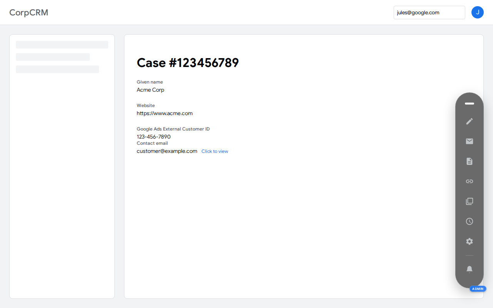
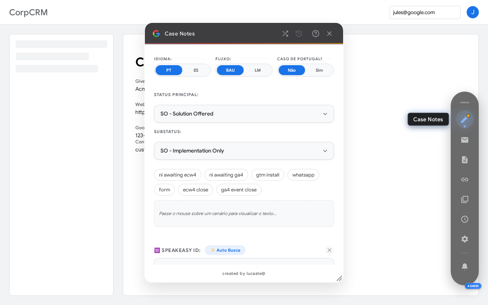
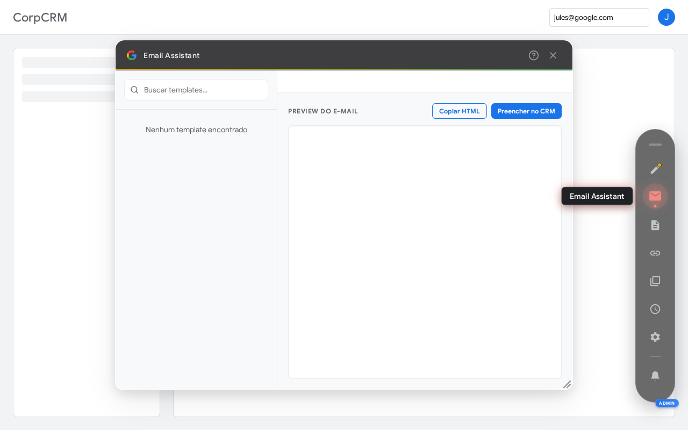
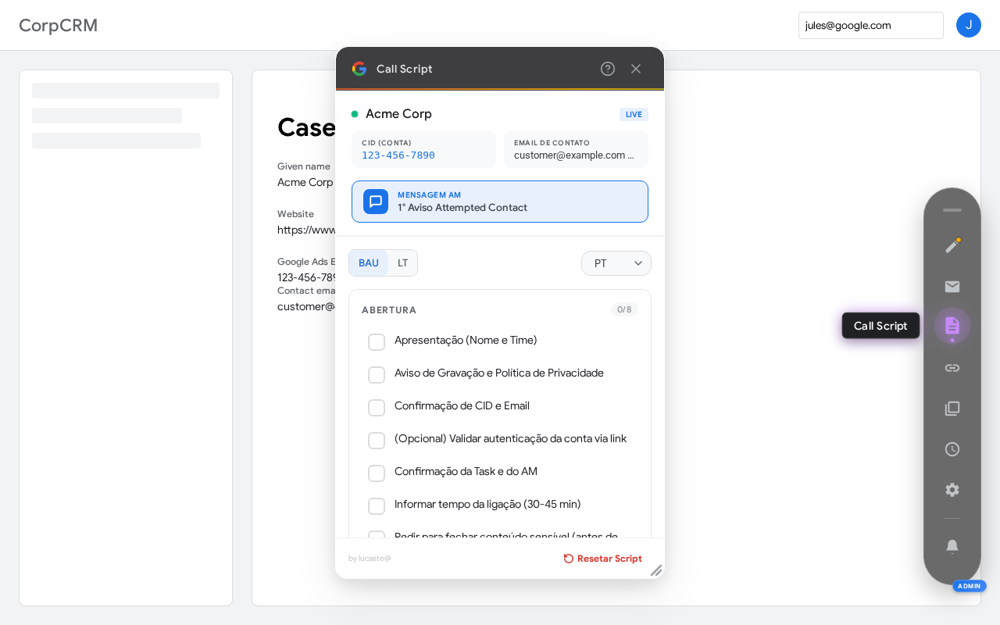
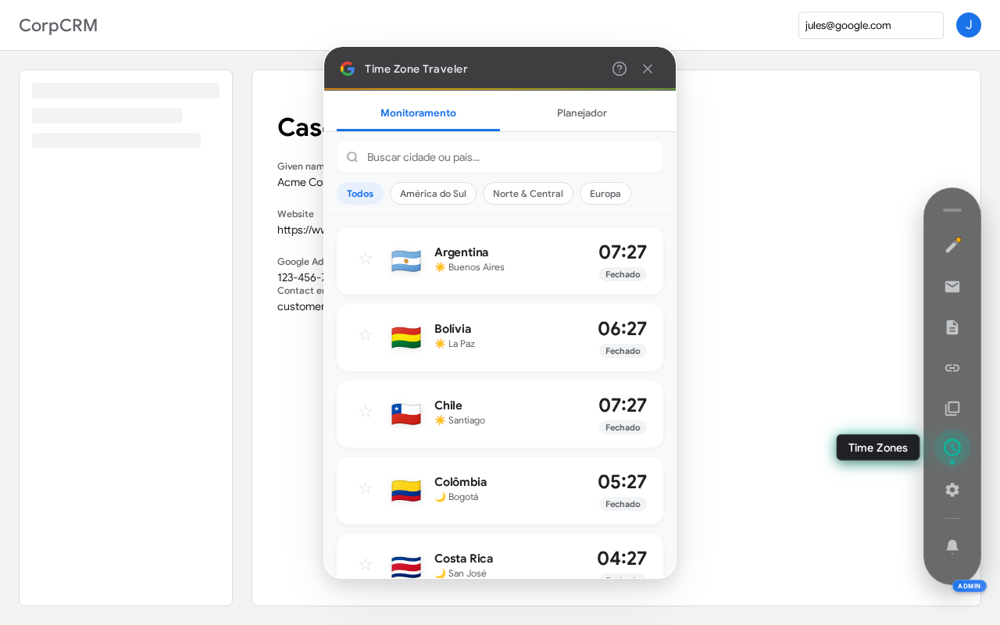

# 🚀 TechSol Operations Assistant

> **Suite de produtividade e automação para o CRM corporativo.**
> *Desenvolvido para aumentar a eficiência dos agentes e padronizar a comunicação.*

Este projeto é uma **camada de aplicação (Overlay)** injetada via JavaScript Bookmarklet. Ele roda "on top" do CRM nativo, manipulando o DOM para adicionar funcionalidades avançadas como automação de e-mails, sistema de broadcast, sons de feedback e melhorias de UX (Material Design).

-----

## 📸 Visual Portfolio

Explore as principais funcionalidades da suite TechSol em um ambiente simulado.

### 🎥 Demonstração em Vídeo
Assista à suite em ação, desde a inicialização com Sound UX até a automação de notas e e-mails:
**[Clique aqui para ver o vídeo de demonstração](docs/media/techsol-demo.webm)**

### 🖼️ Screenshots dos Módulos

| **Command Center** | **Case Notes Assistant** |
| :---: | :---: |
|  |  |
| *Ponto central de acesso e status.* | *Gerador inteligente de notas com lógica condicional.* |

| **Email Assistant** | **Call Script Assistant** |
| :---: | :---: |
|  |  |
| *Templates dinâmicos e rascunhos automáticos.* | *Roteiros guiados para chamadas com clientes.* |

| **Timezone Assistant** |
| :---: |
|  |
| *Conversão de fusos horários e planejamento de reuniões.* |

-----

## 🛠️ Instalação (Bookmarklets)

Para utilizar a ferramenta, crie um favorito no seu navegador e cole o código correspondente no campo URL.

### 🟢 1. Versão Estável (Produção)

*Recomendada para uso diário. Possui bypass de segurança (CSP) e carregamento otimizado.*

```javascript
javascript:(function(){    const cacheBuster = '?t=' + new Date().getTime();    const scriptUrl = 'https://lucastdcs.github.io/techsol_DialIn_AutoCopy/bundle.js' + cacheBuster;        const policy = trustedTypes.createPolicy('default', {         createHTML: (string) => string,         createScriptURL: string => string,         createScript: string => string,     });    const oldScript = document.getElementById('techsol-app-bundle');    if(oldScript) oldScript.remove();        const script = document.createElement('script');    script.id = 'techsol-app-bundle';    script.src = policy.createScriptURL(scriptUrl);    document.body.appendChild(script);})();
```

### 🟡 2. Versão Development (Dev/Debug)

*Para desenvolvedores. Aponta para o bundle de desenvolvimento e inclui logs de console.*

```javascript
javascript:(function(){    var s = document.createElement('script');    s.src = 'https://lucastdcs.github.io/techsol_DialIn_AutoCopy/bundle-dev.js?t=' + new Date().getTime();    s.onload = function() { console.log('✅ TechSol DEV carregado!'); };    s.onerror = function() { alert('❌ Erro ao carregar TechSol DEV: Arquivo não encontrado ou bloqueado.'); };    document.body.appendChild(s);})();
```

-----

## ⚙️ Arquitetura Técnica

O projeto funciona como uma **Single Script Application** injetada externamente. Aqui está o fluxo de execução:

### 1\. Script Injection & Cache Busting

O CRM alvo possui cache agressivo. Para garantir que os agentes sempre recebam a última versão, o bookmarklet anexa um timestamp (`?t=12345...`) na requisição do script:

```javascript
const cacheBuster = '?t=' + new Date().getTime();
```

### 2\. Bypass de CSP (Content Security Policy)

O ambiente do CRM utiliza diretivas de segurança estritas. A versão estável utiliza a API `trustedTypes` para criar uma política de segurança que permite a injeção do script externo hospedado no GitHub Pages, evitando bloqueios do navegador.

### 3\. DOM Manipulation & Event Loop

Uma vez carregado, o `bundle.js`:

1.  **Inicializa o Sound Manager:** Carrega buffers de áudio (Base64) para evitar latência de rede.
2.  **Monta a UI:** Injeta o botão flutuante e os popups usando Web Components nativos ou elementos HTML puros estilizados via CSS-in-JS.
3.  **Observers:** Monitora mudanças na URL e no DOM para detectar quando o usuário entra em uma página de caso ou e-mail.

-----

## 📦 Funcionalidades Principais

### 📧 Automação de E-mail

  * **Detecção de Rascunho:** Algoritmo de *polling* que identifica, descarta e limpa rascunhos "fantasmas" antes de inserir um novo template.
  * **Quick Responses:** Inserção inteligente de texto rico (HTML) com substituição de variáveis (`{{cliente}}`, `{{data}}`).

### 📢 Broadcast System

  * Sistema de avisos globais consumindo JSON remoto.
  * Persistência de leitura via `localStorage`.
  * Suporte a emojis customizados (parser interno de shortcodes).

### 🎨 UX & Sound Design

  * **Sound UX:** Feedback auditivo para ações (Sucesso, Erro, Notificação) e Startup Sound estilo "Netflix/Cinema".
  * **Google Material Look:** Componentes visuais (Dropdowns, Inputs) recriados para se misturar nativamente à interface do Google.

-----

## 💻 Desenvolvimento Local

Este projeto não possui um servidor local (localhost) devido às restrições de HTTPS e CORS do CRM alvo.

**Fluxo de Trabalho Sugerido:**

1.  Faça alterações nos arquivos `.js` locais (`src/`).
2.  Compile o projeto (se houver build step) para `bundle-dev.js`.
3.  Faça push para o branch que alimenta o GitHub Pages.
4.  Use o **Bookmarklet de Dev** para testar as alterações em tempo real no ambiente de produção.

-----

## ⚠️ Notas Importantes

  * **Bloqueios de Rede:** O script depende de acesso ao domínio `github.io`. Se a rede corporativa bloquear, o script não carregará.
  * **Persistência:** As preferências de usuário (posição do widget, mute de som) são salvas no `localStorage` do navegador. Limpar o cache do navegador resetará essas configurações.

-----

> **Status do Projeto:** 🟢 Estável (v2.5)
> **Mantenedor:** [Seu Nome/Time TechSol]